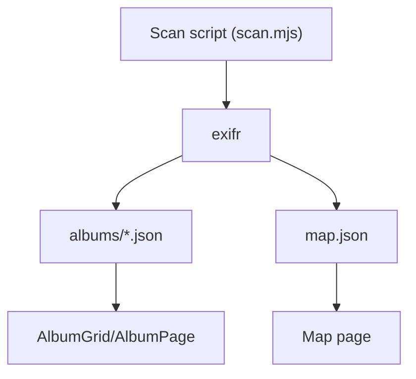

# Map Page & EXIF Geo Plan

### Goal

Implement a **Map** page that shows all geotagged photos on an interactive Leaflet + OpenStreetMap map, backed by a generated `content/map.json` built during the existing scan step.

---

### 1. EXIF & Data Pipeline for Map

- **Inspect current EXIF output**
  - Confirm what EXIF fields we already store in `content/albums/*.json` (we’ve seen camera/lens/date etc., but no GPS yet).
  - Identify the EXIF GPS fields we’ll need from `exifr` (e.g. `GPSLatitude`, `GPSLongitude`, or directly computed `latitude`/`longitude` if available).

- **Extend `scripts/scan.mjs` to capture GPS**
  - Update `extractExif` to `pick` the necessary GPS-related fields.
  - In `processImage`, compute normalized **decimal latitude/longitude** per photo when GPS EXIF exists.
  - Decide on a simple shape for each photo’s geo entry, e.g. `{ albumSlug, albumTitle, filename, path, lat, lng, dateTaken, tags }`.

- **Generate `content/map.json` during scan**
  - While iterating albums/photos in `scan()`, accumulate a flat array of all photos that have valid `lat`/`lng`.
  - After writing `albums.json`, also write `content/map.json`:
    - Structure: `{ photos: [...geoPhotos] }`.
    - Ensure this JSON is small enough and does not duplicate huge EXIF blobs (only keep the fields needed for the map popup/tooltip).
  - Confirm that `scripts/copy-content.mjs` (already used in `build`) will copy `map.json` into `dist/content/map.json` along with albums JSON.

---

### 2. Leaflet + OSM Integration

- **Dependencies & assets**
  - Add `leaflet` as a dependency in `package.json`.
  - Import Leaflet CSS once (e.g. in `src/main.jsx` or `src/index.css`) so default controls/tiles render correctly.

- **Map container styling**
  - Create a small, focused stylesheet (e.g. `src/pages/Map.css`) that:
    - Gives the map a fixed min-height and responsive layout inside the existing `page-shell`.
    - Uses the same dark/monospace aesthetic: subtle borders, maybe a thin frame around the map.

---

### 3. Map Page Implementation (`src/pages/Map.jsx`)

- **Data loading**
  - Replace the current placeholder content with a component that:
    - Fetches `"${import.meta.env.BASE_URL}content/map.json"` on mount.
    - Stores `{ photos }` in state and handles loading/error states in the same retro-mono style.

- **Leaflet map setup**
  - On first render after data load:
    - Initialize a Leaflet map in a `useEffect`, using OSM tiles (e.g. `https://{s}.tile.openstreetmap.org/{z}/{x}/{y}.png`).
    - Compute map bounds from all photo coordinates, and `fitBounds` so all markers are visible; fall back to a default view if there are no geotagged photos.

- **Markers and popups**
  - For each photo in `photos` from `map.json`:
    - Add a simple `L.marker` at `(lat, lng)`.
    - Bind a popup that shows a small thumbnail + text, e.g.:
      - Album title (linking to `/album/:slug`).
      - Date taken and maybe focal length/aperture if desired.
  - Keep the implementation simple at first (no clustering), but structure it so clustering (e.g. `leaflet.markercluster`) can be added later if needed.

---

### 4. UX & Styling Consistency

- **Monospace look on Map page**
  - Reuse the `page-shell` / `page-block` layout already in `App.css` so the Map page header and description match the rest of the site.
  - Ensure labels in the map legend / loading state use `var(--mono-ui)` fonts and uppercase labels for a retro-instrument vibe.

- **Linking back to albums**
  - In each marker popup, provide a clear nav path:
    - "View album: [ALBUM NAME]" linking to `/album/{albumSlug}`.
  - Optionally, highlight the currently open album on the Map page if navigated from an album route in the future (not required for initial implementation).

---

### 5. Testing & Edge Cases

- **Without GPS data**
  - If no photos have GPS EXIF, ensure:
    - `content/map.json` still exists but has `photos: []`.
    - Map page shows a friendly message like "No geotagged photos found" instead of a broken map.

- **Performance & build**
  - Verify `npm run scan` regenerates `map.json` whenever images change.
  - Verify `npm run build` produces `dist/content/map.json` and that the Map page works in `npm run preview`.

- **Cross-check paths**
  - Confirm that photo `path` values in `map.json` match what the frontend uses elsewhere (`images/...` with `import.meta.env.BASE_URL` prepended) to avoid broken thumbnails in popups.