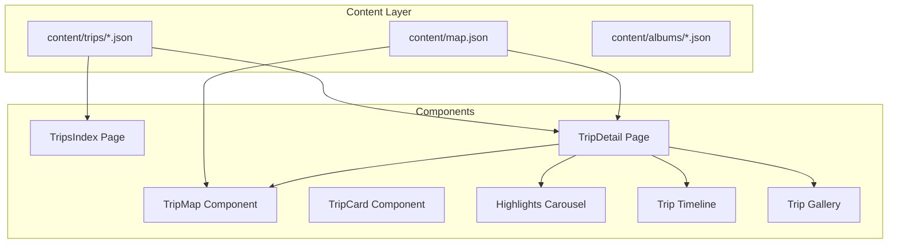

# Trips System Implementation Plan

## Data Architecture



## Phase 1: Content Structure & Data Model

### 1.1 Create Trip Content Folder

- Create `content/trips/` directory
- Add example trip: `content/trips/western-parks-2025.json` with complete schema including:
  - Basic metadata (slug, title, dates, region, summary)
  - albumSlugs array referencing existing albums (e.g., `["cascades", "olympic", "yosemite"]`)
  - Route with polyline points
  - Highlights array with GPS coordinates
  - Media array for supplemental content
  - coverImage path (will use first album photo as fallback if missing)

### 1.2 Create Trip Registry

- Create `src/data/trips.js` exporting:
  ```javascript
  export const TRIP_SLUGS = ['western-parks-2025'];
  ```


### 1.3 Add JSDoc Types

- Create `src/types/trips.jsdoc.js` with comprehensive JSDoc type definitions:
  - `@typedef {Object} Trip` - main trip structure
  - `@typedef {Object} TripHighlight` - highlight with map coordinates
  - `@typedef {Object} TripMediaItem` - supplemental media
  - `@typedef {Object} TripRoutePoint` - polyline points
  - Reuse Photo type from map.json structure

## Phase 2: Routing

### 2.1 Add Trip Detail Route

Update [`src/App.jsx`](src/App.jsx):

- Add route: `<Route path="/trips/:slug" element={<TripDetail />} />`
- The `/trips` route already exists but needs component replacement

## Phase 3: Components - Trips Index Page

### 3.1 Create TripCard Component

Create `src/components/TripCard.jsx` and `src/components/TripCard.css`:

- Display: cover image, title, date range, region, summary
- Cover image fallback logic:
  - Use `trip.coverImage` if present
  - Else if `trip.useFirstAlbumCoverIfMissing`, fetch first album's cover from `content/albums/{slug}.json`
- Link to `/trips/:slug`
- Styling: match existing album card aesthetic (dark theme, hover effects)

### 3.2 Update TripsIndex Page

Update [`src/pages/Trips.jsx`](src/pages/Trips.jsx):

- Load all trip JSONs using TRIP_SLUGS
- Hero section with title "Trips" and description
- Grid layout of TripCard components
- Loading and error states
- Use existing page-shell/page-block styling

## Phase 4: Components - Trip Detail Page

### 4.1 Create TripDetail Page Structure

Create `src/pages/TripDetail.jsx` and `src/pages/TripDetail.css`:

**Data Loading:**

- Load trip JSON from `content/trips/{slug}.json`
- Load `content/map.json` once
- Filter tripPhotos: `allPhotos.filter(p => trip.albumSlugs.includes(p.albumSlug))`

**Sections (scroll-based layout):**

1. **Hero Section**

   - Full-width cover image (fallback to first tripPhotos)
   - Overlaid title

2. **Summary Bar**

   - Trip metadata: title, date range, region
   - Stats: duration (computed from dates), photo count, album count
   - Summary text

3. **Trip Map Section** (see 4.2)

4. **Highlights Carousel** (see 4.3)

5. **Timeline Section** (see 4.4)

6. **All Photos Gallery**

   - Grid/masonry layout of all tripPhotos
   - Sort by dateTaken if available
   - Album-agnostic display
   - Reuse existing Lightbox component for photo viewing

7. **Supplemental Media Section**

   - Render trip.media items by type:
     - `map-image`: standard img with caption
     - `journal`: markdown link or inline display
     - `video`: video element with controls
     - `artifact`: styled image card
     - `gpx`: download link
     - `collage`: full-width image
     - `external-link`: styled link card
   - Grouped subsections if needed

8. **Misc Images Strip** (optional)

   - Horizontal scrolling strip for trip.miscImages
   - "Behind the Scenes" heading

### 4.2 Create TripMap Component

Create `src/components/TripMap.jsx` and `src/components/TripMap.css`:

- Props: `tripPhotos`, `route` (polyline), `onMapReady`
- Initialize Leaflet map similar to existing [Map.jsx](src/pages/Map.jsx)
- Reuse custom marker icon from `public/icons/marker.svg`
- Draw polyline if `trip.route.polyline` exists
- Fit bounds to include markers + polyline
- Expose methods via ref for external control:
  - `panToLocation(lat, lng)` - center map on coordinates
  - `highlightMarker(photoPath)` - optionally highlight specific marker
- Use existing dark theme map styling

### 4.3 Create TripHighlightsCarousel

Create `src/components/TripHighlightsCarousel.jsx` and `.css`:

- Props: `highlights`, `onHighlightHover`, `onHighlightClick`
- Carousel/slider showing each highlight:
  - Large image
  - Title, description, date
- Interaction:
  - On hover/click → callback with `{lat, lng}` to pan map
- Simple CSS-based carousel (no heavy library)
- Keyboard navigation support

### 4.4 Create TripTimeline Component

Create `src/components/TripTimeline.jsx` and `.css`:

- Props: `highlights`, `onItemClick`
- Vertical timeline displaying highlights chronologically
- Each item: date, title, small thumbnail
- On click → callback to:
  - Scroll to corresponding carousel slide
  - Pan map to location
- Simple CSS timeline with dots/lines

## Phase 5: Interactive Map Synchronization

### 5.1 State Management in TripDetail

- `activeHighlightId` state
- `mapRef` ref to access TripMap methods

### 5.2 Implement Interactions

**Hover/Click from Carousel:**

- Call `mapRef.current.panToLocation(lat, lng)`
- Set activeHighlightId

**Click from Timeline:**

- Scroll to carousel slide using `scrollIntoView`
- Call `mapRef.current.panToLocation(lat, lng)`
- Set activeHighlightId

**Optional: Scroll Reveal**

- Use IntersectionObserver on timeline items
- Auto-pan map as user scrolls past timeline items
- Keep implementation simple and well-commented

## Phase 6: Styling & Polish

### 6.1 Consistent Styling

- Reuse existing CSS variables (--mono-ui, --mono-display)
- Match dark theme aesthetic from existing pages
- Responsive layouts (mobile-friendly)
- Smooth transitions for map panning

### 6.2 Loading States

- Skeleton loaders or spinners for trip data
- Graceful degradation if trip.route or highlights missing

## Phase 7: Build Integration

### 7.1 Update Build Script

Update `scripts/copy-content.mjs`:

- Ensure `content/trips/` is copied to `dist/content/trips/` during build

## Files to Create/Modify

### New Files:

- `content/trips/` folder
- `content/trips/western-parks-2025.json`
- `src/data/trips.js`
- `src/types/trips.jsdoc.js`
- `src/pages/TripDetail.jsx`
- `src/pages/TripDetail.css`
- `src/components/TripCard.jsx`
- `src/components/TripCard.css`
- `src/components/TripMap.jsx`
- `src/components/TripMap.css`
- `src/components/TripHighlightsCarousel.jsx`
- `src/components/TripHighlightsCarousel.css`
- `src/components/TripTimeline.jsx`
- `src/components/TripTimeline.css`
- `src/components/TripGallery.jsx`
- `src/components/TripGallery.css`

### Modified Files:

- [`src/App.jsx`](src/App.jsx) - add /trips/:slug route
- [`src/pages/Trips.jsx`](src/pages/Trips.jsx) - replace placeholder with full index
- `scripts/copy-content.mjs` - add trips folder to copy list

## Implementation Notes

1. **No TypeScript**: Use JSDoc comments for type documentation
2. **Photo Sources**: All photos come from existing albums via map.json
3. **Static-Friendly**: All content loaded via fetch, no build-time dependencies
4. **Modular**: Each component is self-contained and reusable
5. **Comments**: Add inline comments explaining data flows and interactions
6. **Fallbacks**: Graceful handling of missing data (no route, no highlights, etc.)

## Testing Checklist

- [ ] /trips shows trip cards with correct data
- [ ] /trips/:slug loads trip details
- [ ] Map displays trip photos and route polyline
- [ ] Clicking highlight pans map to location
- [ ] Clicking timeline item scrolls to carousel and pans map
- [ ] All photos gallery shows images from all trip albums
- [ ] Supplemental media renders correctly by type
- [ ] Responsive on mobile
- [ ] Build script copies trips content to dist/