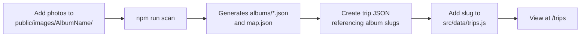
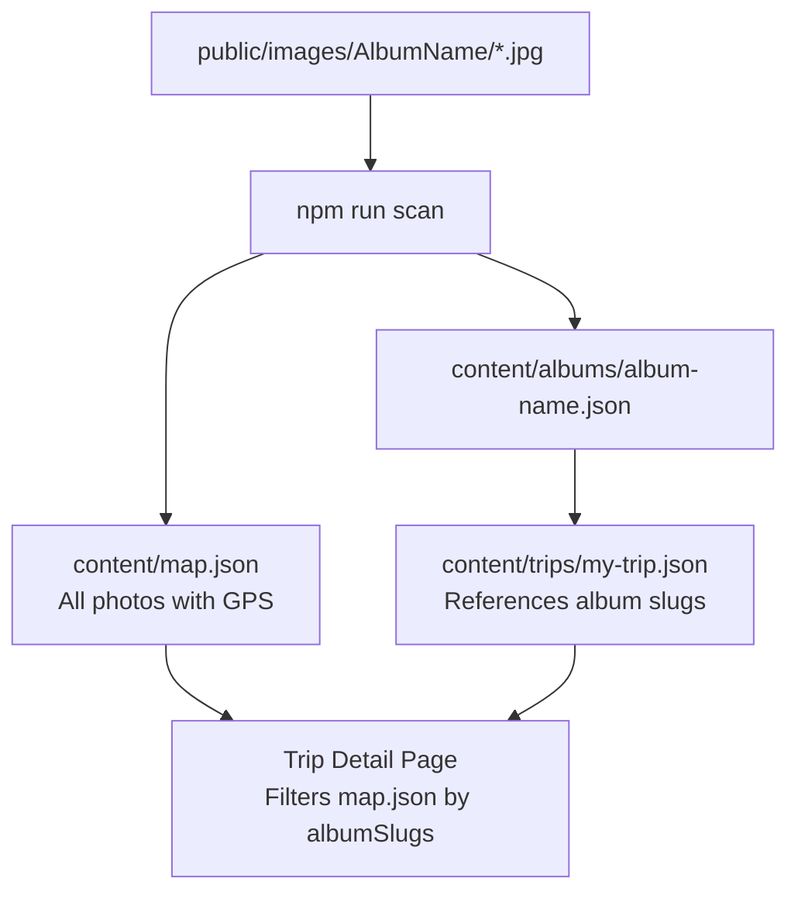

# Trips System Guide

Complete guide to creating and managing trips in your Photo Gallery.

## Table of Contents

- [Overview](#overview)
- [Quick Start](#quick-start)
- [Trip JSON Schema](#trip-json-schema)
- [Creating a New Trip](#creating-a-new-trip)
- [Cover Images](#cover-images)
- [Highlights](#highlights)
- [Route Polylines](#route-polylines)
- [Supplemental Media](#supplemental-media)
- [Integration with Albums](#integration-with-albums)
- [Build Process](#build-process)

---

## Overview

The Trips system allows you to group multiple albums into a cohesive journey, complete with:
- **Route visualization** - Show your path on a map with polylines
- **Highlights** - Key moments with descriptions and map locations
- **Timeline** - Chronological view of highlights
- **Combined gallery** - All photos from trip albums in one place
- **Supplemental media** - Journals, videos, artifacts, GPX files, etc.

**Architecture:**
```
Trip (JSON) → References Albums → Photos come from map.json
```

All trips are **static JSON files** - no backend required.

---

## Quick Start

### 1. Create a trip JSON file

```bash
# Create new trip file
touch content/trips/my-trip-2024.json
```

### 2. Add trip to registry

Edit `src/data/trips.js`:
```javascript
export const TRIP_SLUGS = [
  'western-parks-2025',
  'my-trip-2024'  // ← Add your trip slug here
];
```

### 3. Write trip content

Use the schema below to populate your trip JSON.

### 4. Build and deploy

```bash
npm run build
```

The build script automatically includes `content/trips/` in the production build.

---

## Trip JSON Schema

### Minimal Example

```json
{
  "slug": "my-trip-2024",
  "title": "My Amazing Trip 2024",
  "dateStart": "2024-06-01",
  "dateEnd": "2024-06-10",
  "region": "California, USA",
  "summary": "A wonderful journey through coastal California.",
  "useFirstAlbumCoverIfMissing": true,
  "albumSlugs": ["big-sur", "yosemite", "monterey"]
}
```

### Complete Schema

```json
{
  "slug": "string",              // REQUIRED - URL-safe identifier
  "title": "string",             // REQUIRED - Display title
  "dateStart": "YYYY-MM-DD",     // REQUIRED - Trip start date
  "dateEnd": "YYYY-MM-DD",       // REQUIRED - Trip end date
  "region": "string",            // Optional - Geographic region
  "summary": "string",           // Optional - Trip description
  "coverImage": "string",        // Optional - Path to cover image
  "useFirstAlbumCoverIfMissing": boolean,  // Optional - Fallback behavior
  
  "albumSlugs": ["string"],      // REQUIRED - Album slugs to include
  
  "route": {                     // Optional - Route visualization
    "polyline": [
      { 
        "lat": number, 
        "lng": number, 
        "label": "string"  // Optional
      }
    ],
    "gpxFile": "string"          // Optional - Path to GPX file
  },
  
  "highlights": [                // Optional - Key moments
    {
      "id": "string",            // Unique ID
      "title": "string",
      "description": "string",
      "date": "YYYY-MM-DD",
      "image": "string",         // Optional
      "albumSlug": "string",     // Optional - Source album
      "photoFilename": "string", // Optional
      "mapLat": number,          // Optional - For map pin
      "mapLng": number           // Optional
    }
  ],
  
  "miscImages": [                // Optional - Non-album images
    {
      "src": "string",
      "caption": "string",
      "tags": ["string"]
    }
  ],
  
  "media": [                     // Optional - Supplemental content
    {
      "type": "map-image|journal|video|artifact|gpx|collage|external-link",
      "src": "string",           // For files
      "href": "string",          // For external links
      "caption": "string",
      "title": "string",
      "label": "string"
    }
  ]
}
```

---

## Creating a New Trip

### Step 1: Identify Your Albums

First, determine which albums belong to the trip:
```bash
ls public/images/
# Or check: content/albums/
```

Album slugs are lowercase with hyphens (e.g., `yosemite`, `death-valley`).

### Step 2: Create Trip JSON

Create `content/trips/my-trip-2024.json`:

```json
{
  "slug": "my-trip-2024",
  "title": "California Coast 2024",
  "dateStart": "2024-05-01",
  "dateEnd": "2024-05-15",
  "region": "California, USA",
  "summary": "Two weeks exploring the California coastline from San Diego to San Francisco.",
  "useFirstAlbumCoverIfMissing": true,
  
  "albumSlugs": [
    "san-diego",
    "big-sur", 
    "monterey",
    "san-francisco"
  ],
  
  "route": {
    "polyline": [
      { "lat": 32.7157, "lng": -117.1611, "label": "San Diego" },
      { "lat": 36.2704, "lng": -121.8081, "label": "Big Sur" },
      { "lat": 36.6002, "lng": -121.8947, "label": "Monterey" },
      { "lat": 37.7749, "lng": -122.4194, "label": "San Francisco" }
    ]
  },
  
  "highlights": [
    {
      "id": "golden-gate-sunset",
      "title": "Golden Gate at Sunset",
      "description": "Perfect evening light on the iconic bridge.",
      "date": "2024-05-14",
      "albumSlug": "san-francisco",
      "mapLat": 37.8199,
      "mapLng": -122.4783
    }
  ],
  
  "media": [
    {
      "type": "external-link",
      "href": "https://www.google.com/maps",
      "label": "View full route on Google Maps"
    }
  ]
}
```

### Step 3: Register the Trip

Edit `src/data/trips.js`:
```javascript
export const TRIP_SLUGS = [
  'western-parks-2025',
  'my-trip-2024'  // ← Add here
];
```

### Step 4: Test Locally

```bash
npm run dev
# Navigate to: http://localhost:5173/trips
```

---

## Cover Images

### Option 1: Specify a Cover Image

Provide a direct path:
```json
{
  "coverImage": "images/san-francisco/golden-gate.jpg"
}
```

### Option 2: Use Album Cover Fallback

Let the system use the first photo from the first album:
```json
{
  "coverImage": null,
  "useFirstAlbumCoverIfMissing": true
}
```

This will:
1. Load the first album from `albumSlugs`
2. Fetch that album's JSON
3. Use its `cover` field

### Option 3: No Cover

```json
{
  "coverImage": null,
  "useFirstAlbumCoverIfMissing": false
}
```

Shows a placeholder on the trip card and uses first trip photo on detail page.

---

## Highlights

Highlights are **key moments** from your trip that deserve special attention.

### Structure

```json
{
  "id": "unique-id",
  "title": "Delicate Arch at Sunset",
  "description": "The iconic arch glowing in warm light...",
  "date": "2024-06-15",
  "image": "images/arches/delicate-arch.jpg",
  "albumSlug": "arches",
  "photoFilename": "delicate-arch.jpg",
  "mapLat": 38.7436,
  "mapLng": -109.4993
}
```

### Behavior

- Displays in **carousel** and **timeline**
- Clicking a highlight **pans the map** to its location
- Clicking timeline item **scrolls to carousel** and pans map
- Hover over carousel **pans map** in real-time

### Tips

- **IDs must be unique** within a trip
- **Dates** determine timeline order
- **GPS coordinates** (`mapLat`/`mapLng`) enable map interaction
- **image** can point to any photo or use `null` as placeholder

---

## Route Polylines

Routes are drawn as **dashed lines** on the trip map.

### Basic Route

```json
{
  "route": {
    "polyline": [
      { "lat": 40.7608, "lng": -111.8910, "label": "Salt Lake City" },
      { "lat": 38.5733, "lng": -109.5498, "label": "Moab" },
      { "lat": 38.7331, "lng": -109.5925, "label": "Arches NP" }
    ]
  }
}
```

### With GPX File

```json
{
  "route": {
    "polyline": [...],
    "gpxFile": "/trips/my-trip/route.gpx"
  }
}
```

- `polyline` is displayed as a line connecting points
- `label` creates a small text marker at each point
- `gpxFile` is optional (for downloadable GPS tracks)

### Styling

Routes are rendered with:
- **Color:** Semi-transparent white
- **Style:** Dashed line (10px dash, 5px gap)
- **Weight:** 3px
- Automatically included in map bounds

---

## Supplemental Media

The `media` array supports **7 types** of content:

### 1. Map Image

Static route map or area overview:
```json
{
  "type": "map-image",
  "src": "/trips/my-trip/route-overview.png",
  "caption": "Our 2,000 mile route through the desert."
}
```

### 2. Journal

Markdown or text journal:
```json
{
  "type": "journal",
  "src": "/trips/my-trip/journal.md",
  "title": "Trip Journal",
  "caption": "Day-by-day notes from the road."
}
```

### 3. Video

Video clips:
```json
{
  "type": "video",
  "src": "/trips/my-trip/timelapse.mp4",
  "caption": "Driving through Monument Valley."
}
```

### 4. Artifact

Tickets, passes, ephemera:
```json
{
  "type": "artifact",
  "src": "/trips/my-trip/park-pass.jpg",
  "caption": "National Parks annual pass."
}
```

### 5. GPX File

Downloadable GPS track:
```json
{
  "type": "gpx",
  "src": "/trips/my-trip/track.gpx",
  "caption": "Full GPS track (427 miles)."
}
```

### 6. Collage

Photo collage or composite:
```json
{
  "type": "collage",
  "src": "/trips/my-trip/favorites.jpg",
  "caption": "Best moments compiled."
}
```

### 7. External Link

Links to Google Maps, blog posts, etc:
```json
{
  "type": "external-link",
  "href": "https://maps.app.goo.gl/xyz",
  "label": "View route in Google Maps"
}
```

---

## Integration with Albums

### How Photos Work

Trips **don't store photos directly**. Instead:

1. Trip references albums via `albumSlugs`
2. System loads `content/map.json` (contains all photos)
3. Filters photos: `photo.albumSlug in trip.albumSlugs`
4. Result: all photos from trip's albums

### Requirements

**Albums must exist before creating trips:**
1. Photos in `public/images/{AlbumName}/`
2. Run `npm run scan` to generate album JSON and map.json
3. Then create trip JSON referencing those album slugs

### Album vs Trip Photos

- **Album pages** show photos from one album
- **Trip pages** show photos from multiple albums combined
- Same photos, different contexts

---

## Configuration Files

### Primary Config Files

| File | Purpose | Generated or Manual? |
|------|---------|---------------------|
| `content/trips/*.json` | Trip definitions | **Manual** - You create these |
| `src/data/trips.js` | Trip registry | **Manual** - Add slugs here |
| `content/albums/*.json` | Album data | **Auto-generated** by `npm run scan` |
| `content/map.json` | All photos with GPS | **Auto-generated** by `npm run scan` |
| `content/album-locations.json` | Album GPS defaults | **Semi-auto** - Run `npm run init-locations`, then edit |

### Workflow



---

## Field Reference

### Required Fields

```json
{
  "slug": "my-trip",           // URL identifier (lowercase, hyphens)
  "title": "My Trip",          // Display name
  "dateStart": "2024-01-01",   // ISO format (YYYY-MM-DD)
  "dateEnd": "2024-01-10",     // ISO format
  "albumSlugs": ["album-1"]    // At least one album
}
```

### Optional Fields - Basic

```json
{
  "region": "Utah, USA",                    // Geographic context
  "summary": "Long description...",         // Trip overview
  "coverImage": "images/album/photo.jpg",   // Direct cover path
  "useFirstAlbumCoverIfMissing": true      // Fallback behavior
}
```

### Optional Fields - Advanced

```json
{
  "route": {
    "polyline": [...],     // Array of {lat, lng, label?}
    "gpxFile": "/path"     // Download link
  },
  "highlights": [...],     // Array of highlight objects
  "miscImages": [...],     // Non-album images
  "media": [...]          // Supplemental media
}
```

---

## Highlights Deep Dive

### Purpose

Highlights let you **spotlight specific moments** and **sync them with the map**.

### Full Highlight Object

```json
{
  "id": "arch-sunset",                      // REQUIRED - unique ID
  "title": "Delicate Arch Sunset",          // REQUIRED
  "description": "Long description...",     // REQUIRED
  "date": "2024-06-15",                     // REQUIRED - ISO date
  "image": "images/arches/sunset.jpg",      // Optional - hero image
  "albumSlug": "arches",                    // Optional - source album
  "photoFilename": "sunset.jpg",            // Optional - specific file
  "mapLat": 38.7436,                        // Optional - for map pin
  "mapLng": -109.4993                       // Optional
}
```

### Interactive Features

When `mapLat` and `mapLng` are provided:
- ✅ **Carousel hover** → Map pans to location
- ✅ **Carousel click** → Map pans and highlights
- ✅ **Timeline click** → Scrolls carousel + pans map
- ✅ **Active state** → Highlight syncs across carousel, timeline, map

### Finding Coordinates

**Option 1: Use existing photo GPS**
```bash
# Check map.json for photo coordinates
grep "filename-of-photo.jpg" content/map.json
```

**Option 2: Use album default location**
```bash
# Check album-locations.json
grep "album-slug" content/album-locations.json
```

**Option 3: Google Maps**
1. Find location on maps.google.com
2. Right-click → Copy coordinates
3. Paste as `"mapLat"` and `"mapLng"`

---

## Route Polylines

### Creating a Route

Routes show your **travel path** between locations.

```json
{
  "route": {
    "polyline": [
      { "lat": 40.7608, "lng": -111.8910, "label": "Start: SLC" },
      { "lat": 38.5733, "lng": -109.5498, "label": "Stop: Moab" },
      { "lat": 38.7331, "lng": -109.5925, "label": "End: Arches" }
    ]
  }
}
```

### Labels

- `label` is **optional**
- When provided, shows a small text marker at that point
- Good for cities, parks, or key waypoints

### Styling

Routes are rendered as:
- Semi-transparent white dashed lines
- Automatically fit within map bounds
- Weight: 3px, Dash pattern: 10-5

---

## Supplemental Media

### When to Use Media vs. Albums

- **Albums** = Photo collections with EXIF data
- **Media** = Everything else (videos, maps, journals, links)

### Storing Media Files

Place supplemental files in:
```
public/trips/my-trip-2024/
  ├── route-map.png
  ├── journal.md
  ├── timelapse.mp4
  └── track.gpx
```

Reference in trip JSON as:
```json
{
  "media": [
    {
      "type": "map-image",
      "src": "/trips/my-trip-2024/route-map.png"
    }
  ]
}
```

### Media Type Examples

**Map Image** - Static route overview:
```json
{ "type": "map-image", "src": "/trips/my-trip/map.png", "caption": "Route" }
```

**Journal** - Written reflections:
```json
{ "type": "journal", "src": "/trips/my-trip/journal.md", "title": "Daily Notes" }
```

**Video** - Clips and timelapses:
```json
{ "type": "video", "src": "/trips/my-trip/video.mp4", "caption": "Timelapse" }
```

**Artifact** - Tickets, passes, memorabilia:
```json
{ "type": "artifact", "src": "/trips/my-trip/ticket.jpg", "caption": "Entry pass" }
```

**GPX** - GPS tracks for download:
```json
{ "type": "gpx", "src": "/trips/my-trip/route.gpx", "caption": "GPS track" }
```

**Collage** - Photo compilations:
```json
{ "type": "collage", "src": "/trips/my-trip/collage.jpg", "caption": "Favorites" }
```

**External Link** - Web resources:
```json
{ "type": "external-link", "href": "https://example.com", "label": "Link text" }
```

---

## Integration with Albums

### Data Flow



### Album Slugs

Album slugs are **automatically generated** from folder names:
- `Rocky Mountains` → `rocky-mountains`
- `SF & Rt. 1` → `sf-and-rt-1`
- `Yosemite` → `yosemite`

Check `content/albums/` to see exact slugs.

### Album Requirements

Before referencing an album in a trip:
1. ✅ Photos exist in `public/images/{AlbumName}/`
2. ✅ `npm run scan` has been run
3. ✅ `content/albums/{slug}.json` exists
4. ✅ Photos appear in `content/map.json`

---

## Build Process

### Development

```bash
npm run dev
# Trips available at:
# - http://localhost:5173/trips (index)
# - http://localhost:5173/trips/western-parks-2025 (detail)
```

### Production Build

```bash
npm run build
```

This automatically:
1. Runs `npm run scan` (generates album + map JSON)
2. Builds React app with Vite
3. Copies `content/` → `dist/content/` (includes trips!)

The `scripts/copy-content.mjs` recursively copies all of `content/`, including `trips/`.

### Deployment

After `npm run build`, deploy the `dist/` folder:
- Contains all trip JSON files
- Contains all photos
- Contains all supplemental media
- Ready for static hosting (Netlify, Vercel, GitHub Pages, etc.)

---

## Tips & Best Practices

### Organizing Trips

**By Time Period:**
```
summer-2024.json
fall-2024.json
winter-2024-2025.json
```

**By Region:**
```
southwest-parks.json
pacific-coast.json
rockies-trip.json
```

**By Theme:**
```
national-parks-2024.json
city-photography-2024.json
road-trip-2024.json
```

### Writing Effective Summaries

Keep summaries **concise but evocative**:
```json
{
  "summary": "Three weeks exploring Utah's canyon country. From the red rocks of Arches to the sculpted hoodoos of Bryce, each day revealed new geological wonders."
}
```

### Highlights Selection

Choose **5-10 highlights** per trip:
- ❌ Don't list every moment
- ✅ Pick the most memorable/photogenic
- ✅ Spread them across the trip timeline
- ✅ Include variety (landscapes, wildlife, activities)

### Route Polylines

**Don't over-specify:**
- ❌ Don't include every turn
- ✅ Include major waypoints (cities, parks, landmarks)
- ✅ 5-15 points is usually sufficient

**Example:** For a 1,000 mile trip, 8-12 points is plenty.

---

## Common Workflows

### Creating a Trip from Existing Albums

```bash
# 1. List available albums
ls content/albums/

# 2. Create trip JSON referencing those albums
nano content/trips/my-new-trip.json

# 3. Add to registry
nano src/data/trips.js

# 4. Test
npm run dev
```

### Adding Highlights After the Fact

```bash
# 1. Open trip JSON
nano content/trips/existing-trip.json

# 2. Add to highlights array
# 3. Save

# 4. Refresh browser (hot reload will update)
```

### Updating a Trip's Albums

```bash
# 1. Add new album to public/images/NewAlbum/
# 2. Run scan to generate album JSON
npm run scan

# 3. Add album slug to trip's albumSlugs array
# 4. Rebuild if needed
npm run build
```

---

## Troubleshooting

### Trip Not Showing on /trips

✅ **Check:** Is slug in `src/data/trips.js`?
```javascript
export const TRIP_SLUGS = ['my-trip']; // ← Must be here
```

### Cover Image Not Loading

✅ **Check:**
1. Does `coverImage` path exist in `public/`?
2. Is `useFirstAlbumCoverIfMissing` set to `true`?
3. Do referenced albums have photos?

### No Photos in Trip Gallery

✅ **Check:**
1. Have you run `npm run scan`?
2. Do albums exist in `content/albums/`?
3. Are album slugs spelled correctly?
4. Do photos have GPS coordinates (or album defaults)?

### Map Not Displaying Route

✅ **Check:**
1. Is `route.polyline` an array?
2. Do points have `lat` and `lng` as numbers?
3. Are coordinates in valid range (lat: -90 to 90, lng: -180 to 180)?

### Highlights Not Interactive

✅ **Check:**
1. Do highlights have `mapLat` and `mapLng`?
2. Are they numbers (not strings)?
3. Check browser console for errors

---

## Related Documentation

- **Albums:** See main `README.md` for album management
- **GPS Locations:** See `ALBUM-LOCATIONS-GUIDE.md` for album location setup
- **Scanning:** `npm run scan` generates album and map data

---

## Example: Complete Trip

See `content/trips/western-parks-2025.json` for a fully-featured example including:
- ✅ 10 albums covering 40 days
- ✅ 11-point route polyline from Colorado to Washington
- ✅ 9 detailed highlights with GPS coordinates
- ✅ Supplemental media (map image, external link)
- ✅ Smart cover fallback to first album photo

---

## Support

For issues or questions:
1. Check browser console for errors
2. Verify JSON syntax (use a validator)
3. Ensure `npm run scan` has been run recently
4. Check that referenced albums exist

**Happy trip building! 🗺️✨**

